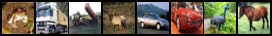
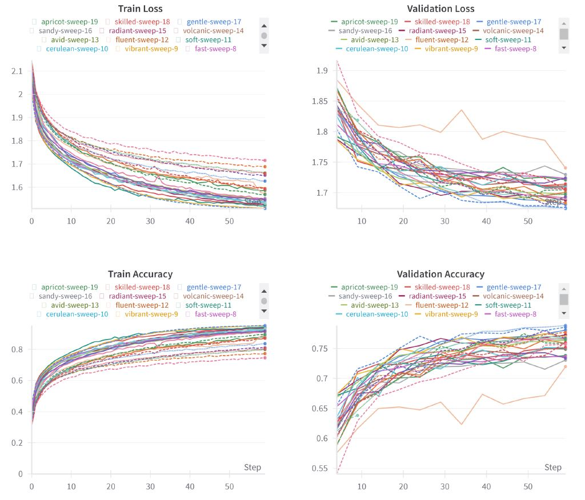
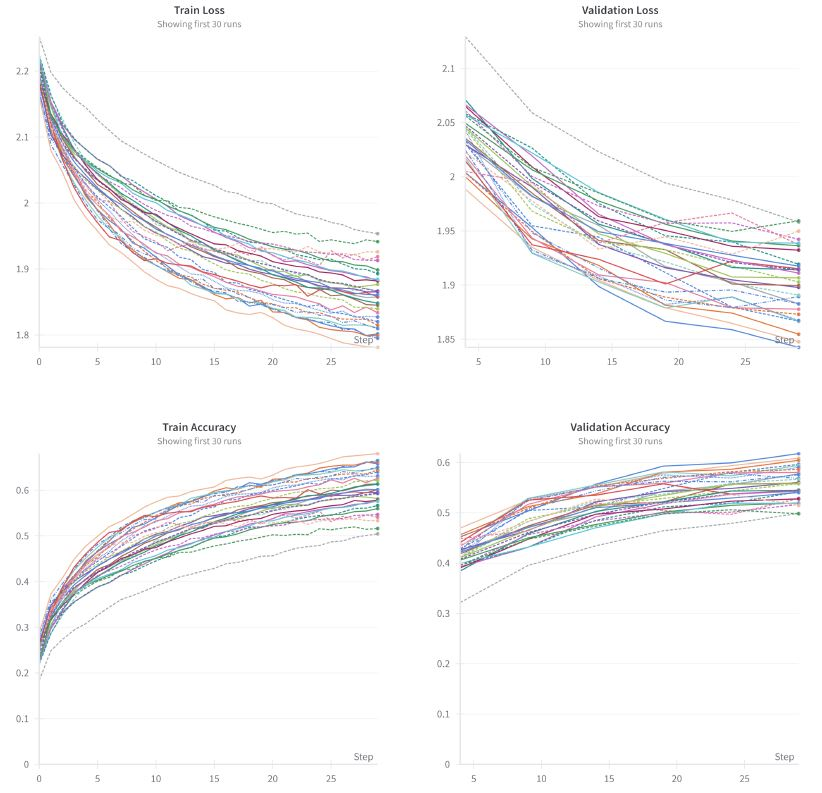
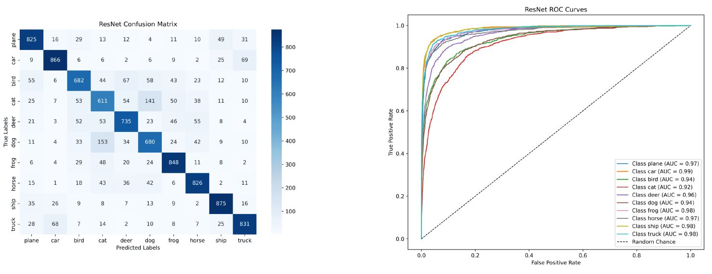
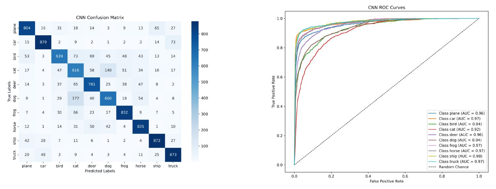
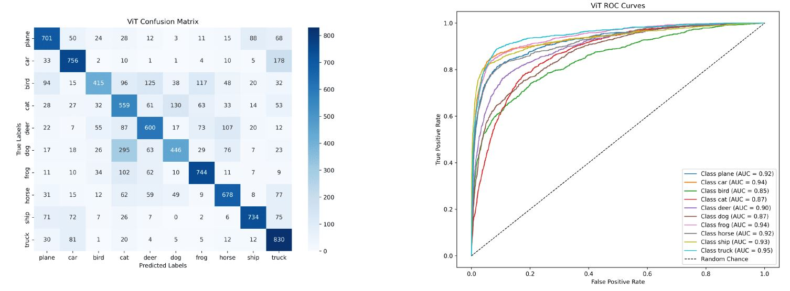

# Deep Learning Models for Image Classification

This project explores the implementation and experimentation of various deep learning models for image classification using the CIFAR-10 dataset. It compares the performance of three architectures: 
- ResNet18
- A custom Convolutional Neural Network (CNN)
- Vision Transformer (ViT).

The goal is to analyze and improve the models through hyperparameter tuning, data augmentation, and regularization techniques.

For a detailed explanation of the methodologies, preprocessing steps, model architecture, and training process, please refer to the [Report](docs/report.pdf) included in this repository.

## Table of Contents
1. [Introduction](#introduction)
2. [Dataset and Preprocessing](#dataset-and-preprocessing)
3. [Model Architectures](#model-architectures)
    - ResNet18
    - Custom CNN
    - Vision Transformer (ViT)
4. [Training Strategies](#training-strategies)
5. [Experimentation and Results](#experimentation-and-results)
    - Hyperparameter Tuning
    - Training and Validation
    - Test Results
    - Model Comparison
6. [Discussion and Conclusions](#discussion-and-conclusions)

## Introduction
This repository implements deep learning models for classifying images from the CIFAR-10 dataset, which contains 60,000 images distributed equally among 10 classes (e.g., frog, truck, bird). The main objectives are:
- To evaluate and compare the effectiveness of different architectures.
- To implement efficient training and tuning strategies.
- To achieve robust performance through advanced regularization and augmentation techniques.

## Dataset and Preprocessing
### Dataset
- **Training Set**: 40,000 samples  
- **Validation Set**: 10,000 samples  
- **Test Set**: 10,000 samples  

The dataset is balanced with RGB images of shape (32, 32, 3).  
Below is a visualization of some sample images from the training set:

### Preprocessing
- Converted to PyTorch tensors.
- Normalized pixel values to ensure uniformity.
- Augmented using techniques like random cropping, horizontal flipping, and rotation.

## Model Architectures
### 1. ResNet18
A pretrained ResNet18 model was adapted for CIFAR-10 by modifying its output layer to predict 10 classes. Its residual blocks help mitigate the vanishing gradient problem.

### 2. Custom CNN
Designed with:
- **Three Convolutional Layers**: Extract features using batch normalization, ReLU activations, and max-pooling.
- **Fully Connected Layers**: Two layers for classification with dropout regularization.

### 3. Vision Transformer (ViT)
Implemented using:
- **Patch Splitting**: Input images are divided into patches, flattened, and linearly projected.
- **Position Embeddings**: Added to retain spatial information.
- **Transformer Encoder**: Modeled using attention mechanisms and feed-forward networks.

## Training Strategies
- Optimizer: **AdamW** with weight decay.
- Learning Rate Scheduler: Exponential decay.
- Regularization: Dropout and data augmentation.
- Early Stopping: Monitored validation performance.

## Experimentation and Results
### Hyperparameter Tuning
- Conducted using [Weights and Biases (WandB)](https://wandb.ai/).
- Optimized parameters like learning rate, dropout, batch size, and patch size.
  
### **CNN Tuning Metrics**

### **ViT Tuning Metrics**  

### Training and Validation
- **ResNet18**: Trained for 60 epochs.
- **Custom CNN**: Trained for 120 epochs.
- **ViT**: Trained for 60 epochs, with and without data augmentation.

For other training details, please refer to the [Report](docs/report.pdf) included in this repository.

### Test Results
- **ResNet18**: Accuracy: 78%, Loss: 1.49  

- **Custom CNN**: Accuracy: 77%, Loss: 1.68  

- **ViT**: Accuracy: 73%, Loss: 1.81  

## Discussion and Conclusions
1. **ResNet18** achieved the highest accuracy but showed signs of overfitting.  
2. The **Custom CNN** performed comparably to ResNet but required twice the training epochs.  
3. The **ViT** demonstrated promising results but required extensive tuning and longer training times.

Future improvements include exploring advanced architectures, extended training, and using larger datasets.
